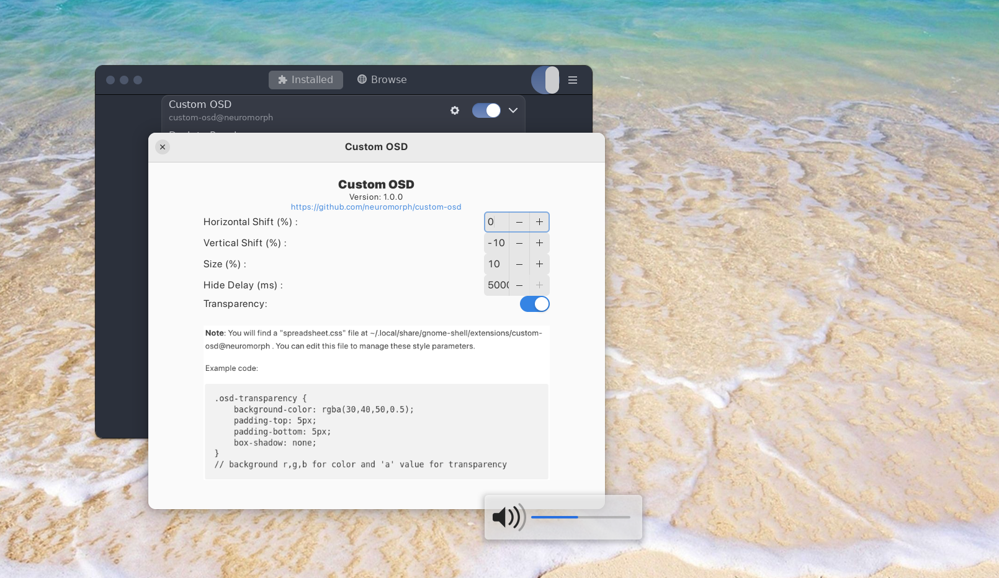

# Custom OSD (GNOME 4X Extension)  


A GNOME Shell extension allowing the user to set the position, size, color, transparency and delay of the OSD popup.


## Installation

### Recommended

[](https://extensions.gnome.org/extension/6142/custom-osd/)

It's recommended to install the extension from
[extensions website](https://extensions.gnome.org/extension/6142/custom-osd/), or from
the _Extension Manager_ app.


### How to manually install the extension (if needed)?

```
git clone https://github.com/neuromorph/custom-osd.git \
	~/.local/share/gnome-shell/extensions/custom-osd@neuromorph
```
OR download the release zip file and unzip at location: ~/.local/share/gnome-shell/extensions/

You may need to restart the gnome shell environnment

- logout and login again (Do this if using Wayland) _or_
- `alt+f2` then type `r` and `enter` 

## Color, Transparency, Padding etc.
<b> Note</b>: You will find a "spreadsheet.css" file at -  
~/.local/share/gnome-shell/extensions/custom-osd@neuromorph  
You can edit this file to manage these style parameters.  

Example code:
```
.osd-transparency {
    background-color: rgba(30,40,50,0.5);
    padding-top: 5px;
    padding-bottom: 5px;
    box-shadow: none;
}
// background r,g,b for color and 'a' value for transparency 
```


## What's new

- Metadata updated for Gnome 44


## TBD

- customize color/transparency from settings

## Screenshots




## Acknowledgements

This version is modified from [Better OSD](https://extensions.gnome.org/extension/1345/better-osd/). The original extension is obsolate and forked versions also do not support new OSD modifications in GNOME after GNOME 41+. This version ports the old extension to new GNOME mods with some additional customizations.
