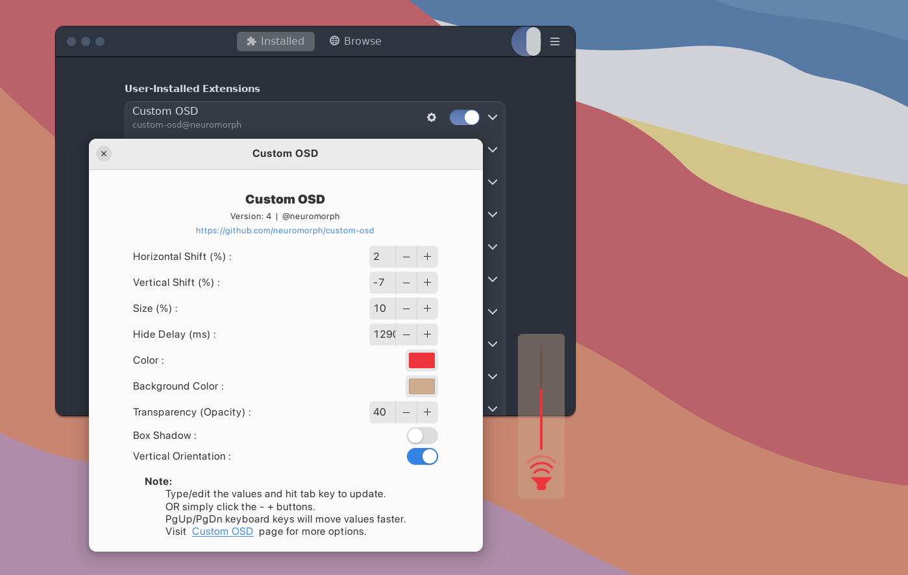

# Custom OSD (GNOME 4X Extension)  


A GNOME Shell extension allowing the user to set the position, size, color, transparency and delay of the OSD popup.


## Installation

### Recommended

[](https://extensions.gnome.org/extension/6142/custom-osd/)

It's recommended to install the extension from
[extensions website](https://extensions.gnome.org/extension/6142/custom-osd/), or from
the _Extension Manager_ app.


### How to manually install the extension (if needed)?

```
git clone https://github.com/neuromorph/custom-osd.git \
	~/.local/share/gnome-shell/extensions/custom-osd@neuromorph
```
OR download the release zip file (may not be latest) and unzip at location: ~/.local/share/gnome-shell/extensions/

You may need to restart the gnome shell environnment (for manual install):

- logout and login again (Do this if using Wayland) _or_
- `alt+f2` then type `r` and `enter` 

## Settings: 
Use the settings panel of the extension for Position, Size, Delay-time, Color and Transparency.  

## Optional Styling: Shadow, Padding etc.
For optional styling of Shadow, Padding etc. you will need to edit "spreadsheet.css" file at -  
~/.local/share/gnome-shell/extensions/custom-osd@neuromorph/  
  

Example code:
```
.osd-style {
    padding-top: 5px;
    padding-bottom: 5px;
    box-shadow: none;
}
```


## What's new
- Settings updated for Color and Transparency
- Metadata updated for Gnome 44


## Screenshots




## Acknowledgements

This version is modified from [Better OSD](https://extensions.gnome.org/extension/1345/better-osd/). The original extension is obsolete and forked versions also do not support new OSD modifications in GNOME shell after GNOME 41+. This version ports the old extension to new GNOME mods and adds additional customizations through settings.
