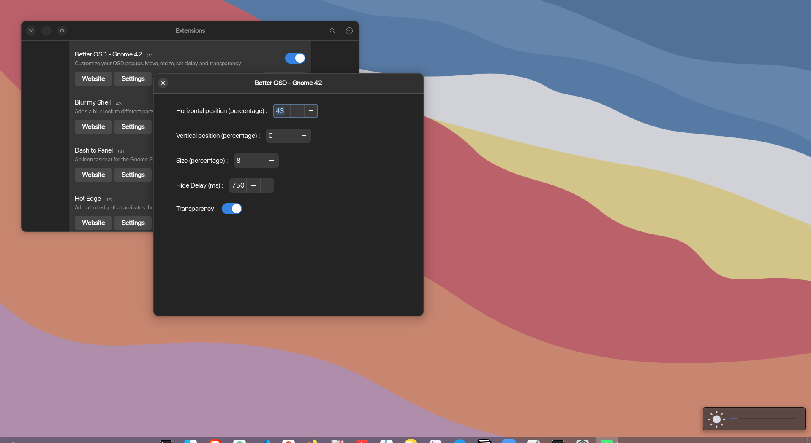

# Better OSD (GNOME 42 Extension)

A GNOME Shell extension allowing the user to set the position, size, color, transparency and delay of the OSD popup.

## Installation


> How to manually install the extension ?

```
git clone https://github.com/neuromorph/better-osd.git \
	~/.local/share/gnome-shell/extensions/better-osd@neuromorph
```
OR download the release zip file and unzip at location: ~/.local/share/gnome-shell/extensions/

You may need to restart the gnome shell environnment

- logout and login again _or_
- `alt+f2` then type `r` and `enter` //This option doesn't work on Wayland

## Color, Transparency, Padding etc.
You will find a spreadsheet.css file at ~/.local/share/gnome-shell/extensions/better-osd@neuromorph
You can edit this file to manage these style parameters.
Example code:
```
.osd-transparency {
    background-color: rgba(30,40,50,0.5);
    padding-top: 5px;
    padding-bottom: 5px;
    box-shadow: none;
}
```
- background r,g,b for color and 'a' value for transparency

## What's new

#### 1.0
- move OSD popup with horizontal and vertical percentage
- set size percentage
- set delay of OSD popup

#### 2.0
- added transparency toggle

## Upcoming

- transparency slider for custom opacity
- refined preference window

## Screenshots




> without transparency


> with transparency


## Details

This is forked version modified to work with GNOME 40 from [here](https://extensions.gnome.org/extension/1345/better-osd/).
